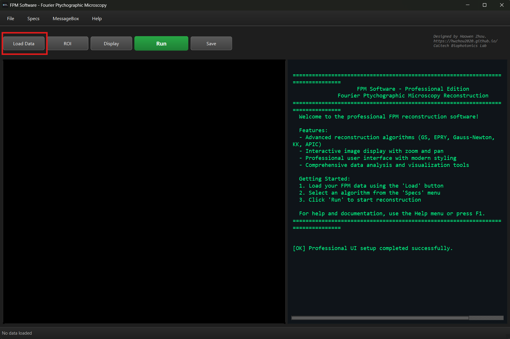
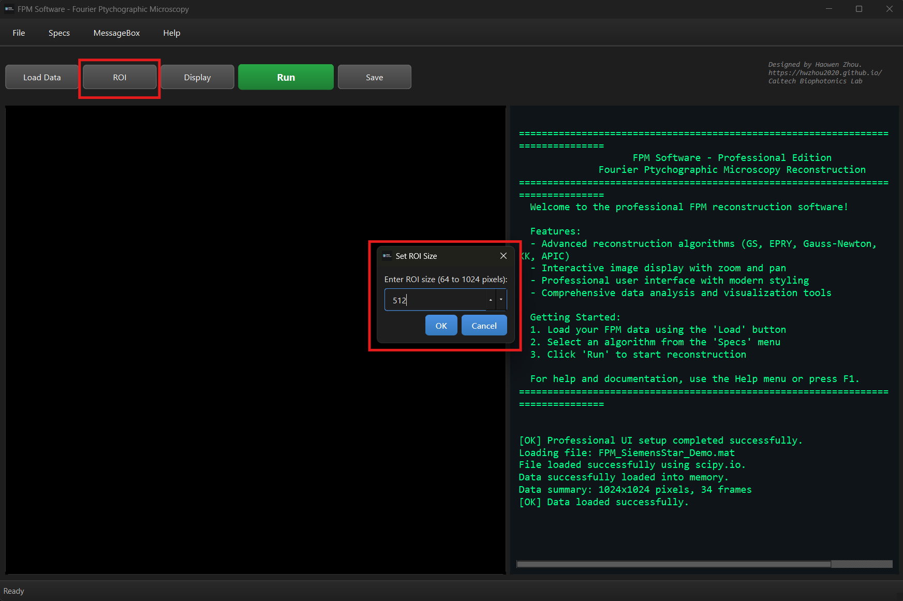
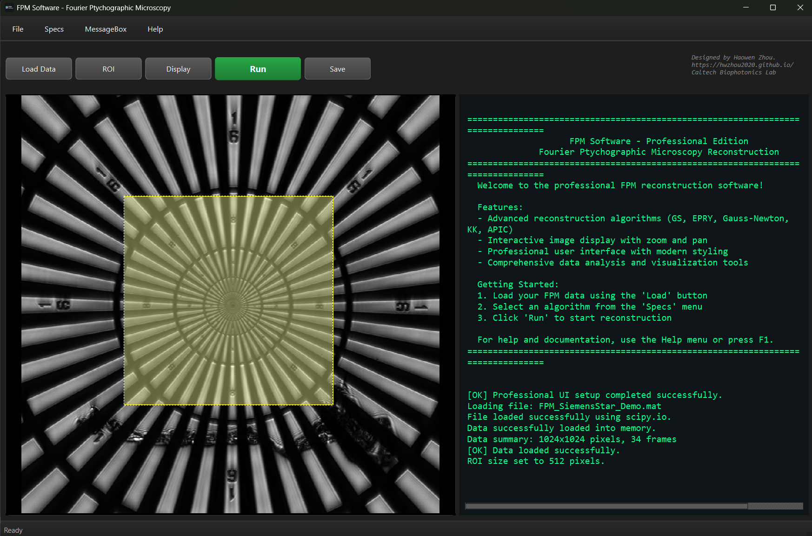
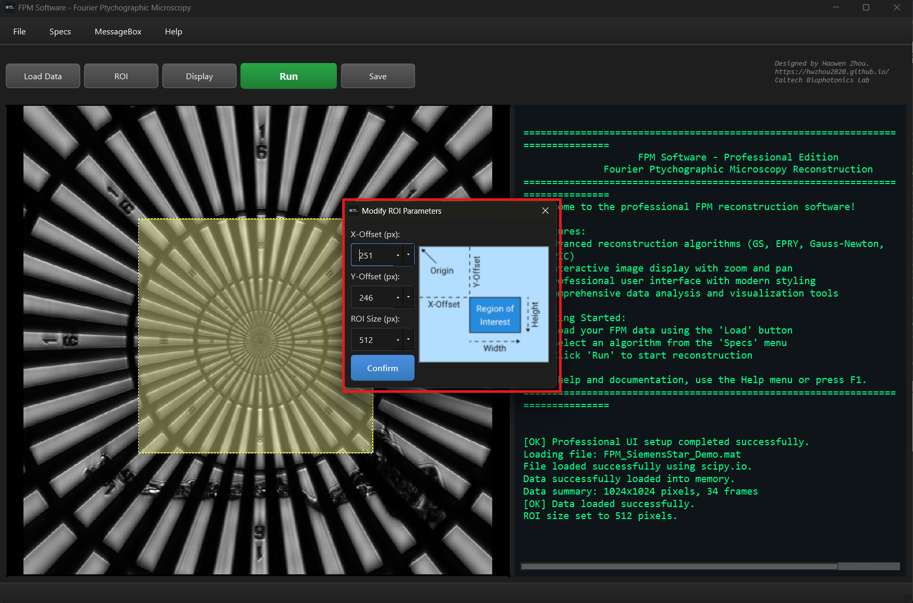
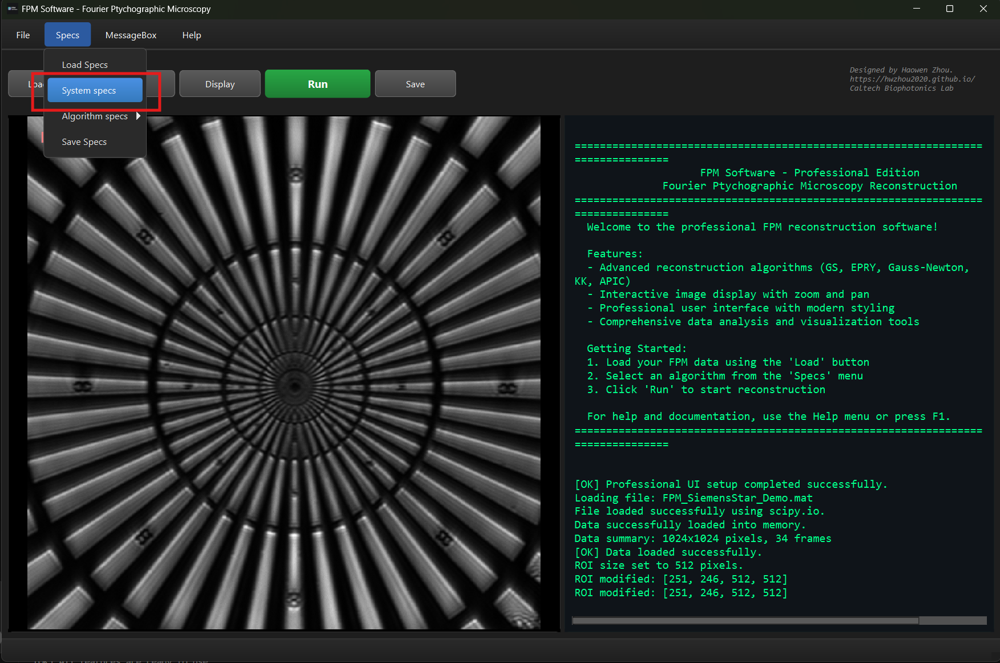
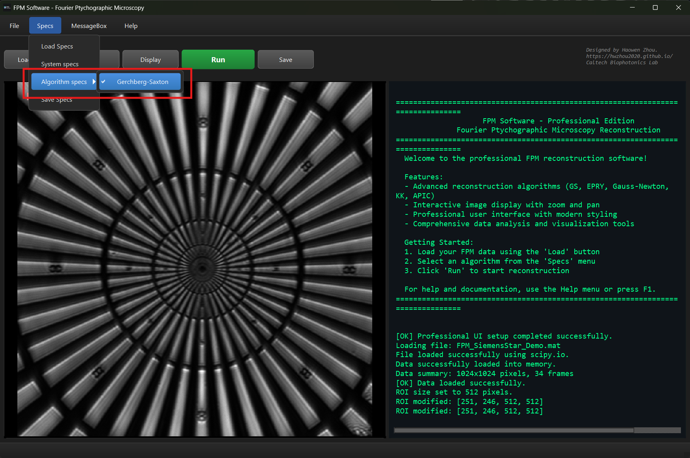
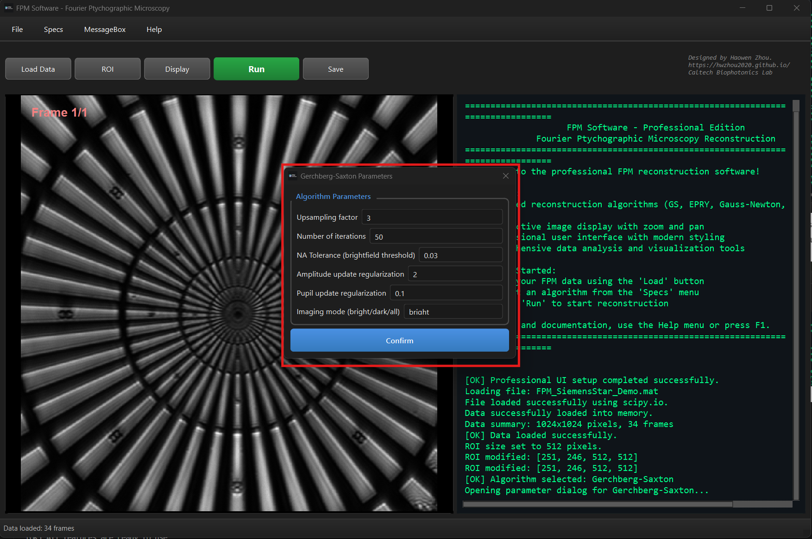
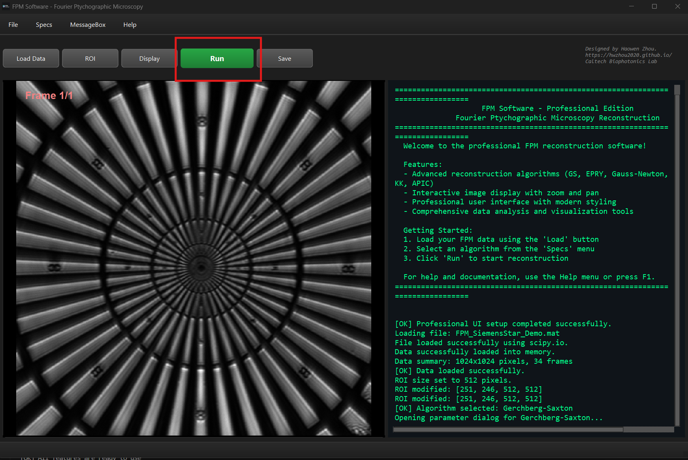
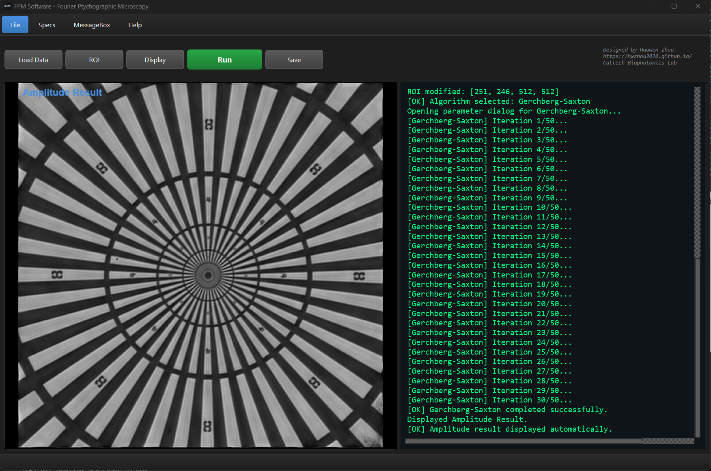
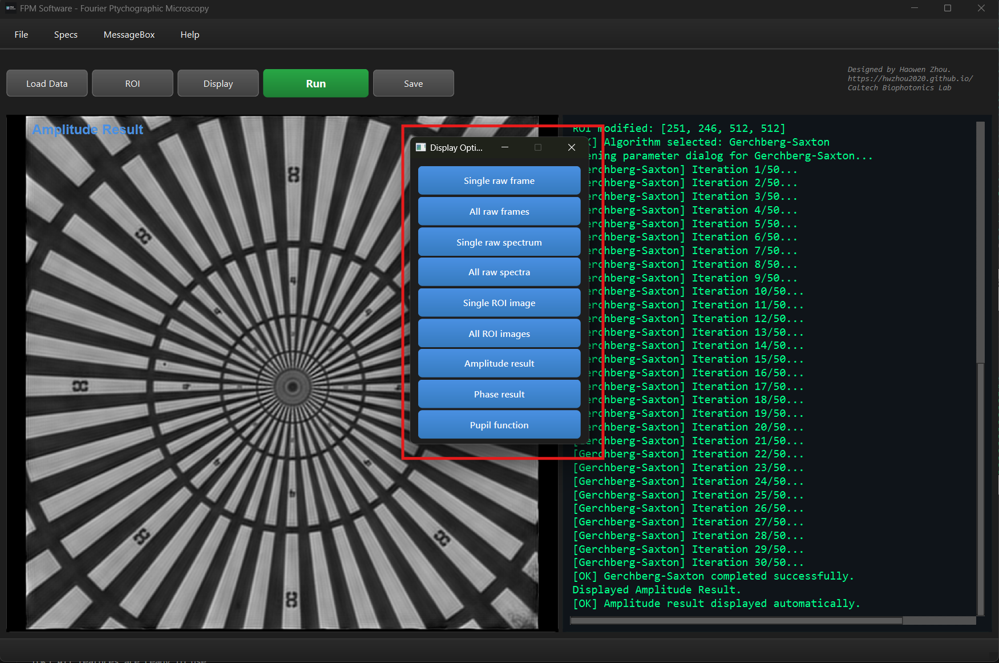

# FPM Software - Fourier Ptychographic Microscopy

[](https://www.python.org/downloads/)
[](https://opensource.org/licenses/MIT)
[](https://pypi.org/project/PySide6/)
[](#)

## Introduction

This repository contains a comprehensive software package for Fourier Ptychographic Microscopy (FPM) reconstruction algorithms with a professional, modern graphical user interface.

The FPM software aims to serve as a platform for different image reconstruction algorithms, making algorithm benchmarking and instrument usage easier. 

Users can either format public FPM raw data in a specific way (See Data Format section), or use their own microscope system to collect customized data. 

The software is still being developed. If you are interested in contributing to this project, please contact Haowen Zhou (See Author and Contributing Sections). 

## 🚀 Quick Start

1. Clone the repository and enter the project directory:
```bash
git clone https://github.com/hwzhou2020/FPM_software.git
cd FPM_software
```

### Option 1: Auto-Launcher (Recommended)
```bash
# Run the professional launcher (handles dependencies automatically)
python launch_fpm_professional.py
```
 <!-- If you encounter "QPaintDevice" errors, use the no-splash version:
 python launch_fpm_no_splash.py -->

### Option 2: One-Click Installation
```bash
# Run the auto-installer
python install_fpm.py

# Launch the software
python main.py
```

### Option 3: Use Launcher Scripts
**Windows:**
```bash
# Professional launcher (recommended)
launch_fpm_professional.bat

# Or standard launcher
run_fpm.bat
```
<!-- # No-splash version (if you get paint device errors)
launch_fpm_no_splash.bat -->

**Linux/Mac:**
```bash
# Make executable and run
chmod +x run_fpm.sh
./run_fpm.sh
```

### Option 4: Manual Installation
```bash
# Install dependencies
pip install -r requirements.txt

# Test your installation (optional)
python test_installation.py

# Run the software
python main.py
```

## 📋 System Requirements

- **Python**: 3.9 or higher
- **Operating System**: Windows, macOS, or Linux
- **Memory**: 8GB RAM minimum (16GB+ recommended for large datasets)
- **GPU**: Optional but recommended for faster processing (CUDA-compatible)

## 📦 Dependencies

### Core Dependencies
- **PySide6**: GUI framework with professional theming
- **NumPy & SciPy**: Scientific computing
- **PyTorch**: Deep learning framework for algorithms
- **mat73**: MATLAB file support
- **PyYAML**: Configuration management
- **psutil**: System resource monitoring

### Optional Dependencies
- **OpenCV**: Enhanced image processing
- **scikit-image**: Additional image analysis tools
- **tqdm**: Progress bars

### Additional Dependencies
- This may depends on the algorithms to be used


## 📖 Usage

### Getting Started
1. **Launch**: Run `python launch_fpm_professional.py` for the best experience
2. **Load Data**: Click "Load Data" or press Ctrl+O to load .mat files.

3. **Select ROI**: Use the "🎯 ROI" button to select region of interest and define the size of the Region of Interest (ROI).

Drag the Yellow-shaded Box to the desired ROI, and double click the box to confirm the selection.

The "Modify ROI Parameters" window will then pop-up. If any changes to the ROI are needed, please do modifications here.

4. **Set System Specs (Optional)** The system specifications will be automatically set when loading the data. If additional modifications are needed, the specifications can be accessed at "Specs → System specs".

5. **Choose Algorithm and Configure Parameters (Optional)**: Go to Specs → Algorithm specs to select the desired algorithm. By default, it will use the Gerchberg-Saxton algorithm. Algorithm-specific parameters can also be set in the pop-up window when clicking this tab.


6. **Run Reconstruction**: Click "Run" or press Ctrl+R.

7. **View Results**: Amplitude results display automatically. Click the "Display" button for additional display options.


8. **Additional Features** 
- The "MessageBox" menu can be used to log, save or clear the contents of the text box on the right-handed side of the user interface.
- The "Help" menu provides access to documentation and general software info.
- The "File" menu allows you to save and load results, and set the default save directory.

**In progress**
- The "Save specs" menu is still in development, and will be released in a future version.
- More algorithms and demo data will be included in future versions.

## 📁 Data Format

The repository includes a canonical sample dataset at `data/Demo_data/FPM_SiemensStar_Demo.mat`. Loading it with either MATLAB or `scipy.io.loadmat` reveals the structure validated by the FPM software.
The expected field names are described in the following table:

| Field | Shape (rows × cols × frames) | Dtype | Description |
| --- | --- | --- | --- |
| `imlow` | `M × M × N` | `uint8`, `uint16` | Stack of low-resolution intensity images; the first two dimensions are spatial coordinates, the third indexes illumination angles. |
| `NA_list` | `N × 2` | `float16`, `float32`, `float64` | Illumination numerical aperture (NA) coordinates `(kx, ky)` normalized to the objective NA. Row `n` pairs with `imlow[:, :, n]`. |
| `NA` | `1 × 1` | `float16`, `float32`, `float64` | Objective numerical aperture (demo value `0.26`). |
| `dpix_c` | `1 × 1` | `float16`, `float32`, `float64` | Camera pixel pitch in micrometers (`3.45 µm` for the demo sensor). |
| `lambda` | `1 × 1` | `float16`, `float32`, `float64` | Illumination wavelength in micrometers (`0.5162 µm`, i.e., 516.2 nm). |
| `mag` | `1 × 1` | `float16`, `float32`, `float64` | System magnification (`10` in the demo example). |

**Follow these rules when formatting custom raw data:**
- Represented the data in a `.mat` file. A future release may support additional file types. 
<!-- - Keep scalar metadata as `1x1` arrays so both MATLAB and Python readers treat them as scalars. -->
- Align the ordering of `imlow` slices with the rows of `NA_list`. (Mismatches break Fourier stitching.) 
- Use micrometer units for wavelength and pixel pitch.
- Keep NA coordinates unitless to match the internal models.
- Additional metadata can be stored in other keys; the loader ignores unknown fields but requires the six listed above.

## 🛠️ Installation Methods

### Method 1: Conda (Recommended for Scientific Computing)
Use the curated environment file when you want a reproducible stack that already pins GPU/CUDA-capable packages.
```bash
# 1) Create the environment from the spec
conda env create -f docs_package/environment.yml
# 2) Activate it whenever you work on FPM
conda activate fpm_env
# 3) Launch or run the smoke test
python main.py            # or python test_installation.py
```
If you upgrade packages inside this env, remember to export an updated `environment.yml` so collaborators can mirror it.

### Method 2: pip Installation (Virtualenv/venv)
Choose this when you prefer lightweight installs or are deploying on systems without Conda. Create an isolated virtual environment first:
```bash
# Windows (PowerShell)
python -m venv .venv
.\\.venv\\Scripts\\activate

# macOS/Linux
python -m venv .venv
source .venv/bin/activate
```
Then install dependencies and run the app:
```bash
python -m pip install --upgrade pip setuptools wheel
python -m pip install -r requirements.txt
python main.py
```
Run `python launch_fpm_professional.py` instead of `main.py` if you want the dependency auto-checker and splash UI.

<!-- ### Method 3: Development Installation (Editable mode)
Use editable installs when you plan to modify the package and import it elsewhere.
```bash
# Inside your activated environment
python -m pip install --upgrade pip setuptools wheel
python -m pip install -e .
```
This links the working tree directly into the interpreter, so changes in the source take effect immediately. Pair it with the test suite before sending patches:
```bash
python test_installation.py
python launch_fpm_professional.py  # manual sanity check
```
For IDEs, point the interpreter to the same environment so linting and Qt Designer integration uses the installed package. -->


## 🐛 Troubleshooting

### Common Issues

**Python not found:**
```bash
# Install Python from https://www.python.org/downloads/
# Or use Anaconda: https://www.anaconda.com/products/distribution
```

**Import errors:**
```bash
pip install -r requirements.txt
```

**Test your installation:**
```bash
python test_installation.py
```

**GUI not displaying:**
```bash
# Linux: Install X11
sudo apt-get install python3-tk

# Run with debug mode
python -X dev main.py
```

**Memory issues:**
- Reduce ROI size
- Lower upsampling factor
- Close other applications

**QPaintDevice errors:**
```bash
# Use the no-splash version to avoid paint device issues
python launch_fpm_no_splash.py

# Or on Windows:
launch_fpm_no_splash.bat
```

## 🤝 Contributing

1. Fork the repository
2. Create a feature branch (`git checkout -b feature/amazing-feature`)
<!-- develop your feature or your algorithm -->
<!-- Use `pip install .`  to run and test (checklist)  considering a contributing.md file -->
3. Commit your changes (`git commit -m 'Add amazing feature'`)
4. Push to the branch (`git push origin feature/amazing-feature`)
5. Open a Pull Request

## 📄 License

This project is licensed under the MIT License - see the [LICENSE](LICENSE) file for details.

## 👨‍💻 Author

**Haowen Zhou** - Caltech Biophotonics Lab
- Website: https://hwzhou2020.github.io/
- GitHub: [@hwzhou2020](https://github.com/hwzhou2020)

## 🙏 Acknowledgments

- Caltech Schmidt Academy for Software Engineering
- Caltech Biophotonics Lab

## 📚 Documentation

- [Web Help Guide](Documentation/help.html)
- [Markdown Help Guide](Documentation/help.md)
- [Installation Guide](INSTALL.md)
- [Professional UI Guide](PROFESSIONAL_UI_IMPROVEMENTS.md)

---
